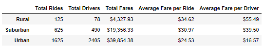
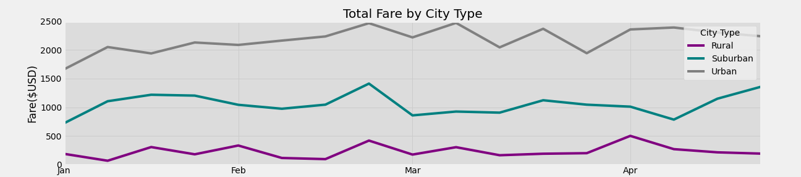

How did you analyze the data to create the technical deliverables?
What can be said about the summary DataFrame and multiple-line graph with respect to the ride-sharing data among the different city types? Include images of the summary DataFrame table and the multiple-line graph in these results.
A short summary of the results.

# PyBer Challenge 
### Overview
The CEO of PyBer has given me a new assignment, one that will require:
* Creating a summary DataFrame of the key metrics for the ride-sharing data by city type;
* Creating a multiple-line graph that shows the total fares for each week by each city type; and 
* Submitting a written report on the results of the new analysis, challenges you encountered and overcame, and any future recommendations for analysis.
### Resources
Data Source:
* city_data.csv
* ride_data.csv
* Software: Python 3.7.6, Anaconda 4.8.3, Jupyter Notebook 6.0.3

### Analysis 

In order to provide firther insight for the ride-sharing data by city type for PyBer, the data was detaily analyzed to create a frame work that guided the project. In order to create the appropriate variables, I analyzed the data by type, count and null values. After confirming that the data was clear to be used for technical variables, I created a workback plan to guide the outcomes.  

#### If we compare the average number of rides between each city type, we’ll notice that the average number of rides in the rural cities is about 4 and 3.5 times lower than urban and suburban cities, respectively.
There is one outlier in the urban ride count data. Also, the average number of rides in the rural cities is about 4- and 3.5-times lower per city than the urban and suburban cities, respectively.

